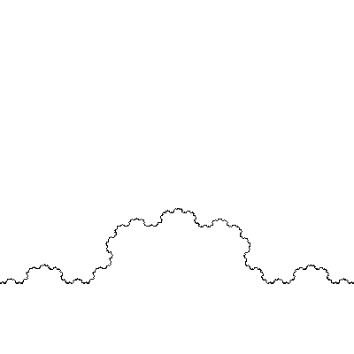
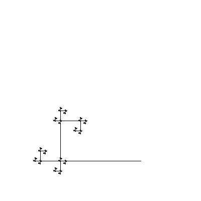

# FractalLine 
### Python 3.11

## About the mini-project

You can use it to make and view a fractal consisting of lines.

You can view a fractal in a window with a transition animation or make a picture or a video

## Examples

https://github.com/3NikNikNik3/FractalLine/assets/161970751/d80c84fc-cb24-4305-b868-78e329b1f671

```main.py setting/90ang.json 500 500 video example/ex1.mp4 6 1 60```



```main.py setting/max.json 400 400 window 0.5```



```main.py setting/spiral.json 400 400 window 0.5```

## About the construction algorithm

Initially, there is a straight line. In each iteration, each straight line is divided into several new ones, and their ends move according to the rule:

1) turning the walking angle (initially as in the straight line)
2) go to a part of the length of the original straight line

## About the settings

The settings file format is JSON, they are in ```setting``` (optional)

The ``setting/min.json`` shows the minimum parameters, and the ``setting/max.json`` shows the same thing, but with all parameters. You can get acquainted with the structure in them

List of all parameters:

- ```start``` and ```end``` - initial position of a straight line (0.0 - 1.0)
- ```alg``` - algorithm for constructing new lines, a list of objects for each new line
- ```alg/ang``` - angle of rotation of the direction of movement in the corners
- ```alg/len``` - length of the movement (in the length of the original straight line)
- ```r``` - width of the straight line rendering
- ```color``` - straight line's color  (the fon - \[255, 255, 255\])
- ```auto_end``` - when straight lines are divided, should to add a point to the end of the straight line (fixed)
- ```end_len``` - length of the last straight line (as a fraction of the original straight line) (used when ``auto_end`` = true) (needed for animation)

## How to launch

Via the console (Linux, Window)

To find out how, enter ```main.py help``` ._.

## A couple of examples

There are various settings in the ```setting```, try it :-)

In ```example/example.png``` beautiful)

```main.py setting/max.json 400 400 window 1```

```main.py setting/min.json 400 400 window 0.1```

```main.py setting/what2.json 400 400 screenshot 10 res.png```
